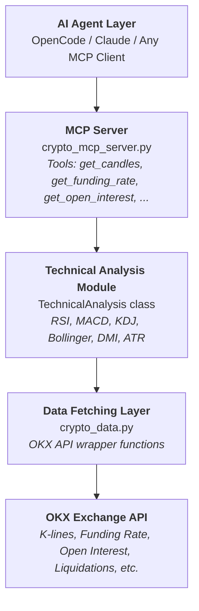

# CryptoView

> **An AI-powered crypto trading analysis agent that was right when I was wrong.**

---

## The Story Behind This Project

On the night of **January 29, 2026, at 23:53:24**, this agent told me to short ETH.

I didn't believe it. I went long instead.

I lost a lot of money.

So here we are. Open-sourcing this beast for everyone to see (and hopefully learn from my expensive lesson).

**The agent was right. The human was wrong. Tale as old as time.**

The `evidence` folder shows the first-hand story, it was in Mandarin, but I believe every one can understand the sorrow.

---

## What Is This?

CryptoView is an AI-powered cryptocurrency and precious metals market analysis system. It fetches real-time data from OKX exchange, performs comprehensive technical analysis, and provides actionable trading signals.

The core philosophy:
- **Data over gut feeling** (unlike me on that fateful January night)
- **Multi-dimensional verification** (Trend + Momentum + Volatility + Structure)
- **Multi-timeframe confirmation** before any conclusion
- **Strict risk control** (which I clearly didn't follow)

---

## Tech Stack

| Component | Technology | Purpose |
|-----------|------------|---------|
| **Language** | Python 3.11+ | Core analysis engine |
| **Data Processing** | pandas, numpy | Technical indicator calculation |
| **HTTP Client** | requests, urllib3 | OKX API communication |
| **AI Integration** | MCP (Model Context Protocol) | Agent tool interface |
| **Data Source** | OKX Exchange API | Real-time market data |

### Architecture



---

## Features

### Market Data (via MCP Tools)

| Tool | Description |
|------|-------------|
| `get_candles` | K-line/OHLCV data (1m to 1W timeframes) |
| `get_funding_rate` | Perpetual contract funding rates |
| `get_open_interest` | Open interest with USD valuation |
| `get_long_short_ratio` | Elite trader positioning data |
| `get_liquidation` | Historical liquidation records |

### Technical Indicators

| Category | Indicators |
|----------|------------|
| **Trend** | MA (5/10/20/50), EMA (12/26), DMI/ADX |
| **Momentum** | RSI (6/14), MACD (DIF/DEA/Histogram), KDJ |
| **Volatility** | Bollinger Bands, ATR |
| **Volume** | OBV (On-Balance Volume) |
| **Structure** | Fibonacci Retracement, Support/Resistance |

### Supported Assets

| Code | Name | Spot | Perpetual |
|------|------|------|-----------|
| BTC | Bitcoin | BTC-USDT | BTC-USDT-SWAP |
| ETH | Ethereum | ETH-USDT | ETH-USDT-SWAP |
| BNB | BNB | BNB-USDT | BNB-USDT-SWAP |
| SOL | Solana | SOL-USDT | SOL-USDT-SWAP |
| ZEC | Zcash | ZEC-USDT | ZEC-USDT-SWAP |
| XAU | Gold | - | XAU-USDT-SWAP |

---

## Installation

### Prerequisites

- Python 3.11+
- Network access to OKX (proxy may be required in some regions)

### Setup

```bash
# Clone the repository
git clone https://github.com/your-username/crypto.git
cd crypto

# Install dependencies
pip install -r requirements.txt
```

### Dependencies

```
pandas>=2.0.0
numpy>=1.24.0
requests>=2.31.0
urllib3>=2.0.0
```

---

## Usage

### Option 1: Direct Python API

```python
import sys
sys.path.insert(0, r'D:/Crypto/.opencode/skills/crypto/scripts')
from technical_analysis import TechnicalAnalysis

# Fetch data and calculate all indicators
ta = TechnicalAnalysis.from_api("BTC-USDT", bar="1H", limit=100)
indicators = ta.get_all_indicators()

# Get latest values
latest = indicators.iloc[-1]
print(f"Price: {latest['close']:.2f}")
print(f"RSI(14): {latest['rsi14']:.2f}")
print(f"MACD DIF: {latest['macd_dif']:.4f}")
print(f"ADX: {latest['dmi_adx']:.2f}")
```

### Option 2: MCP Integration

Add to your MCP client configuration:

```json
{
  "mcpServers": {
    "crypto": {
      "command": "python",
      "args": ["D:/Crypto/.opencode/skills/crypto/scripts/crypto_mcp_server.py"],
      "env": {
        "PYTHONIOENCODING": "utf-8"
      }
    }
  }
}
```

Then your AI agent can call tools like:

```python
# Get ETH 4-hour candles
skill_mcp(
  mcp_name="crypto",
  tool_name="get_candles",
  arguments={"inst_id": "ETH-USDT", "bar": "4H", "limit": 100}
)

# Get funding rate
skill_mcp(
  mcp_name="crypto",
  tool_name="get_funding_rate",
  arguments={"inst_id": "ETH-USDT-SWAP", "limit": 50}
)
```

### Option 3: Batch Analysis

```python
from technical_analysis import analyze_all_assets

# Analyze multiple assets at once
results = analyze_all_assets(
    inst_ids=['BTC-USDT', 'ETH-USDT', 'SOL-USDT'],
    bar='1D',
    limit=100
)
# Results saved to result/ folder with timestamp
```

---

## Project Structure

```
crypto/
├── AGENTS.md                          # Agent behavior policy
├── README.md                          # You are here
├── requirements.txt                   # Python dependencies
│
└── .opencode/
    ├── mcp.json                       # MCP server configuration
    │
    └── skills/
        └── crypto/
            ├── SKILL.md               # Skill documentation
            │
            ├── scripts/
            │   ├── crypto_data.py         # OKX API wrapper
            │   ├── crypto_mcp_server.py   # MCP protocol server
            │   └── technical_analysis.py  # TA indicator engine
            │
            └── references/
                └── indicators.md      # Technical indicator guide
```

---

## How the Agent Works

The agent follows a strict 4-dimensional analysis protocol:

### 1. Trend Analysis
- Moving averages alignment (MA5 > MA10 > MA20 = bullish)
- DMI/ADX for trend strength (ADX > 25 = confirmed trend)

### 2. Momentum Analysis
- RSI for overbought/oversold (>70 or <30)
- MACD crossovers and histogram patterns
- KDJ for short-term extremes

### 3. Volatility Analysis
- Bollinger Bands for price position and squeeze
- ATR for stop-loss distance calculation

### 4. Multi-Timeframe Confirmation
- Lower timeframe signals validated against higher timeframe trend
- Signal degraded 50% if higher timeframe opposes

### Trade Plan Output

Every analysis includes:
- **Direction**: Long / Short / Neutral
- **Entry Zone**: Price range for entry
- **Stop Loss**: Based on ATR (1.5-2x ATR)
- **Take Profit**: Based on Fibonacci or ATR (2-3x ATR)
- **Confidence Level**: High / Medium / Low

---

## Configuration

### Proxy Settings

The project defaults to using a local proxy at `127.0.0.1:7890`. To change this, edit `crypto_data.py`:

```python
DEFAULT_PROXY = {
    "http": "http://127.0.0.1:7890",
    "https": "http://127.0.0.1:7890"
}
```

Or disable proxy entirely:

```python
df = get_okx_candles("BTC-USDT", use_proxy=False)
```

---

## Lessons Learned (The Hard Way)

1. **Always trust data over emotions** - The agent saw something in the derivatives data I didn't want to see
2. **Multi-timeframe confirmation is not optional** - I looked at one timeframe and got rekt
3. **Stop losses exist for a reason** - I didn't set one
4. **When an AI and your gut disagree, maybe give the AI a chance** - It processes data faster than you can rationalize bad decisions

---

## Disclaimer

This project is for educational and research purposes only. **Not financial advice.**

The author lost money ignoring this agent's signals. You might too. Trade at your own risk.

Remember: The market can stay irrational longer than you can stay solvent.

---

## License

MIT License - Use it, fork it, learn from it, but don't blame me if you also ignore the signals.

---

*"The agent was right. I just didn't listen."*
*— Author, January 30, 2026*
